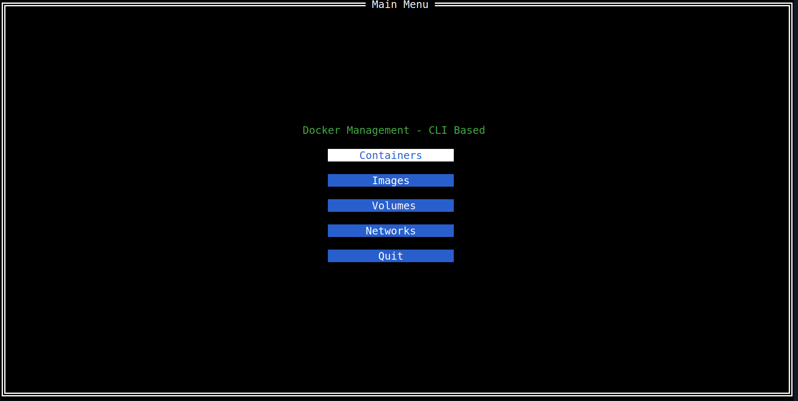
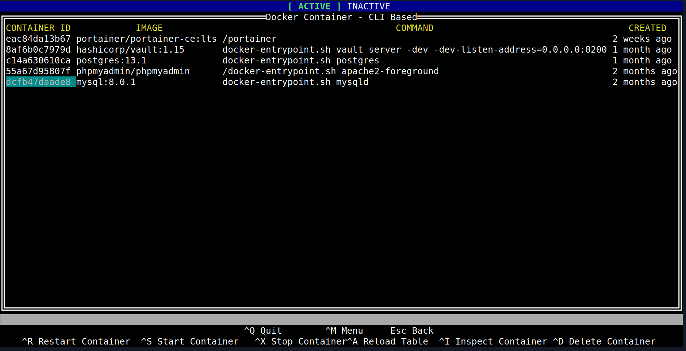
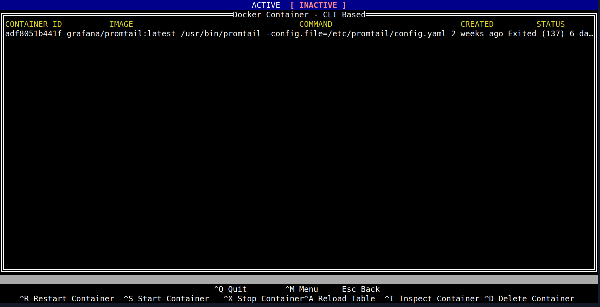
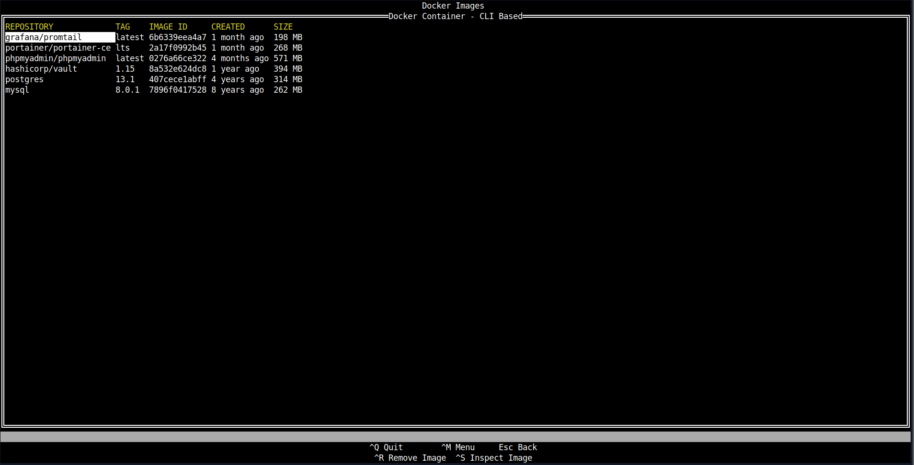
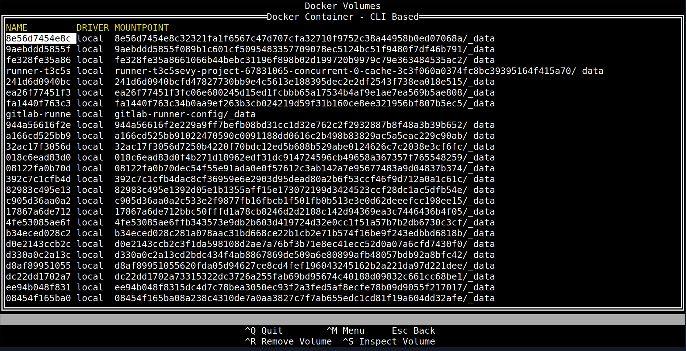
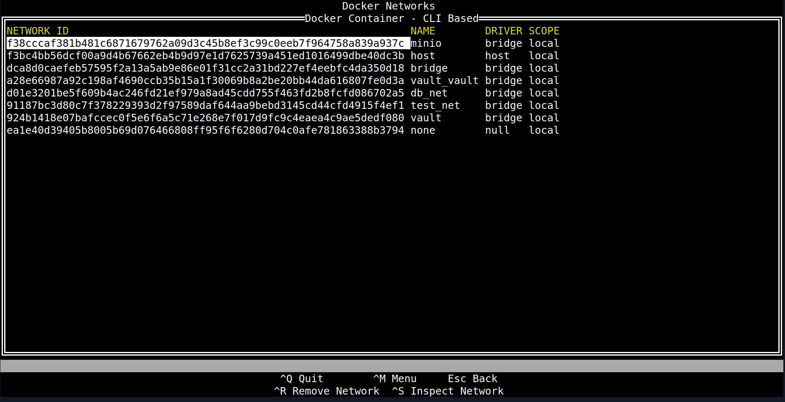

# Doki

**A Lightweight and Interactive Terminal UI for Docker**

**main menu**


**containers menu**



**image menu**


**volume menu**


**network menu**


## ✨ Overview

**Doki** is your friendly, intuitive terminal user interface (TUI) for managing Docker containers, images, volumes, and networks with ease. Built with Go and `tview`, Doki provides a streamlined experience for monitoring and interacting with your Docker environment directly from your command line.

Whether you're a developer, sysadmin, or just love working in the terminal, Doki aims to simplify your daily Docker workflows.

**Part of the [PeternakClouds](https://peternakclouds.com) family of tools.**

## 🚀 Features

- **Container Management:**
  - List running and exited containers.
  - Start, stop, restart, and remove containers with simple keybindings.
  - Toggle between "Active" and "Inactive" container views.
  - Auto-refresh for real-time status updates.
- **Resource Navigation:**
  - View Docker Images.
  - Explore Docker Volumes.
  - Inspect Docker Networks.
- **Detailed Inspection:** Dive deep into container details with an integrated inspect modal.
- **Intuitive Keybindings:** Navigate and perform actions quickly.
- **Clean & Responsive UI:** Designed for clarity and efficiency in your terminal.

## 📦 Installation

Doki is written in Go, making it easy to install from source or via pre-compiled binaries.

### From Pre-compiled Binaries (Recommended for most users)

Pre-compiled binaries for Linux, macOS, and Windows will be available on the [releases page](https://github.com/kusumaningrat/doki/releases). Download the appropriate archive for your system, extract it, and place the `doki` executable in your system's PATH.

```bash
# Example for Linux With amd64 architecture
wget [https://github.com/kusumaningrat/doki/releases/download/v0.1.0/doki-linux-amd64](https://github.com/kusumaningrat/doki/releases/download/v0.1.0/doki-linux-amd64)
sudo chmod +x doki-linux-amd64
sudo mv doki-linux-amd64 /usr/local/bin/doki
doki # Run the app!
```
